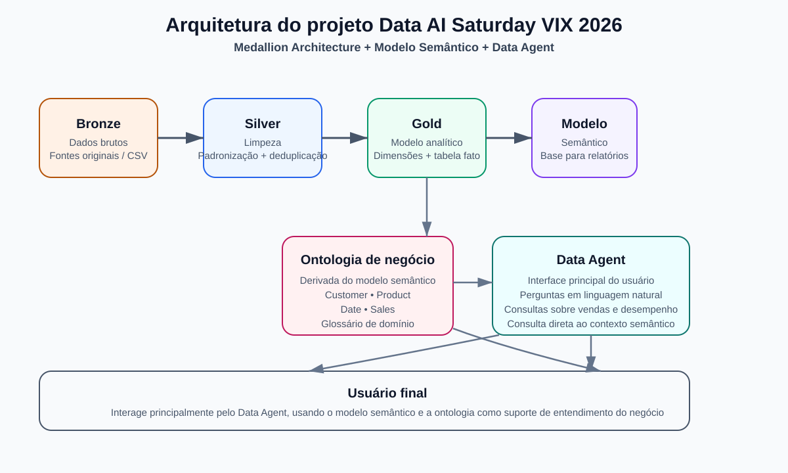

# Data AI Saturday VIX 2026

Este repositório reúne uma demonstração de arquitetura analítica em Microsoft Fabric para um cenário de vendas, seguindo o padrão medallion architecture e com suporte a um data agent e modelo semântico.

O objetivo principal é mostrar, em um ambiente de estudo e apresentação, como organizar dados brutos, limpar e enriquecer informações em camadas, transformar em modelo dimensional e disponibilizar contexto semântico para consulta em linguagem natural.

## Visão geral do projeto

A solução está contida na pasta [Demo-Medallion-Architecture-Data-Agent](Demo-Medallion-Architecture-Data-Agent), que inclui:

- Lakehouses para Bronze, Silver e Gold
- Notebooks para ingestão e transformação
- Ontologia de domínio para vendas
- Data agent de vendas
- Modelo semântico para consumo analítico

## Estrutura do repositório

```text
.
├── .gitignore
├── .specify/
│   ├── constitution.md
│   └── feature.json
├── Demo-Medallion-Architecture-Data-Agent/
│   ├── README.md
│   ├── Lakehouse_Bronze.Lakehouse/
│   ├── Lakehouse_Silver.Lakehouse/
│   ├── Lakehouse_Gold.Lakehouse/
│   ├── Notebook_Ingest_Orders.Notebook/
│   ├── Notebook_Transform_Silver.Notebook/
│   ├── Notebook_Transform_Gold.Notebook/
│   ├── Ontology_Sales_Gold.Ontology/
│   ├── Data_Agent_Sales_Gold.DataAgent/
│   ├── Semantic_Model_Sales_Gold.SemanticModel/
│   └── ...
├── specs/
│   └── 001-medallion-data-agent/
│       ├── spec.md
│       ├── plan.md
│       └── tasks.md
└── README.md
```

## Arquitetura adotada

O projeto segue a abordagem de medalhão:

- Bronze: dados brutos e originados em arquivos de entrada
- Silver: limpeza, padronização, deduplicação e regras de qualidade
- Gold: modelo dimensional pronto para análise e consumo semântico

Além disso, a solução inclui:

- ontologia de negócio para facilitar o entendimento do domínio
- agente de dados para consulta em linguagem natural
- modelo semântico para exploração analítica



## Como usar

1. Abra a pasta [Demo-Medallion-Architecture-Data-Agent](Demo-Medallion-Architecture-Data-Agent).
2. Revise os notebooks na ordem de execução:
   - Notebook de ingestão
   - Notebook de transformação para Silver
   - Notebook de transformação para Gold
3. Valide os Lakehouses e os objetos criados nas camadas.
4. Explore a ontologia e o modelo semântico para consumir o contexto de negócio.

## Observações importantes

- A pasta de dados foi mantida como artefato principal do projeto e não foi reestruturada, conforme solicitado.
- A parte de documentação e governança foi organizada para melhor apresentação e commit.
- O repositório também inclui a estrutura de Spec Kit em [specs/001-medallion-data-agent](specs/001-medallion-data-agent).

## Contribuição

Este é um projeto de demonstração/estudo. Contribuições podem incluir:

- refinamento da arquitetura
- melhorias na documentação
- ajustes na semântica de negócio
- novas validações e métricas de qualidade

## Licença

Este projeto é destinado a uso educacional e de demonstração.

---

Projeto desenvolvido para o evento Data AI Saturday VIX 2026.